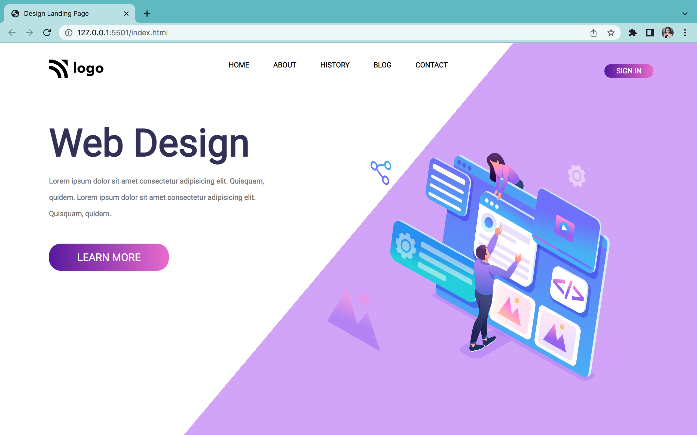

# Project 8
Hello there it's Neha Pandey.

### Project 8 is about Digital Marketing home page.

## Challenges
In this project i had to design in css and i learnt so much in this project like:
- font-size
- use of liner-gradient (to right, to left ,deg)
- width and height of image
- selectors
- margin and padding

### ## Total time to complete this project

It took 3.5 hours to complete this project in 3.5 hours.

